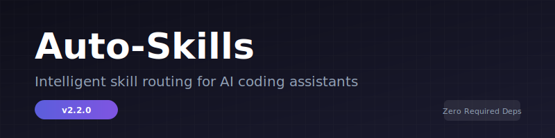
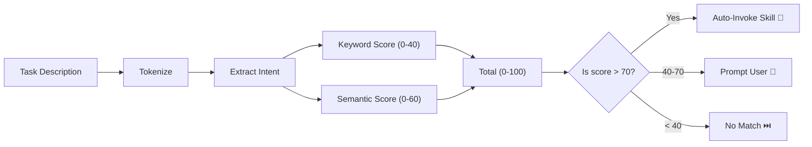

<picture>
  <source media="(prefers-color-scheme: dark)" srcset="assets/banner.svg">
  
</picture>

<p align="center">
   
  
  
  
  
  
  
</p>

# Auto-Skills

Never ask _"which skill should I use?"_ again.

**Auto-Skills** is a zero-dependency, multi-platform skill router for AI coding assistants (OpenCode, Claude Code, Gemini CLI). It parses your task description, scores every installed skill using hybrid keyword + semantic analysis, and automatically invokes the best match — before you even finish typing.

Built for developers who want their AI tools to be **proactive**, not reactive.

---

## ✨ Features

| Icon | Feature | Why It Matters |
|------|---------|---------------|
| 🧠 | **Smart Matching** — hybrid 0-100 scoring (keyword overlap + semantic relevance) | Picks the right skill even when your description is vague |
| ⚡ | **Zero Required Runtime Dependencies** — pure Node.js, `@huggingface/transformers` optional for semantic mode | No `node_modules` bloat for basic usage |
| 🔌 | **Multi-Platform** — OpenCode, Claude Code, Gemini CLI | One setup, works everywhere |
| 🧪 | **Deterministic CLI** — offline pre-scoring tool | Test and debug skill matching without an LLM |
| 🛡️ | **Secure by Default** — path traversal protection, no telemetry, no network calls | Your code never leaves your machine |
| 🔍 | **Auto-Discovery** — `--scan` finds every installed skill | Score your entire skillset with one command |
| 🏷️ | **Index Mode** — `--index` builds a lightweight skills index | Reduce LLM prompt overhead by ~85% |
| 📦 | **Self-Contained** — 8 files, ~660 LOC | Fully auditable in an afternoon |

---

## 🚀 Quick Start

```bash
# Clone the skill to your agents directory
git clone https://github.com/artgaurav16420-oss/Auto-Skills.git ~/.agents/skills/auto-skill-select

# Auto-scan all installed skills and find the best match
node scripts/skill-matcher.js --scan "debug the login bug"

# Run the test suite
npm test
```

**30 seconds. No npm install. No network calls.**

---

## ⚙️ How It Works — The Scoring Engine

Every task goes through a **4-stage pipeline**:



Once your task is tokenized and analyzed, the skill with the highest score is either auto-invoked (≥70), suggested as an option (40-70), or skipped (<40).

| Stage | Description |
|-------|-------------|
| **Tokenize** | Lowercase, strip punctuation, remove stop words |
| **Extract Intent** | Classify tokens into domain, action, technology, keywords |
| **Keyword Overlap (0-40)** | Match domain/action/tech tokens against skill descriptions |
| **Semantic Overlap (0-60)** | Match remaining keywords at word boundaries against skill descriptions |

The **40/60 split** ensures exact keyword hits don't override broader contextual fit.

---

## 🖥️ CLI Usage

The companion `scripts/skill-matcher.js` CLI lets you test scoring offline, inspect scores, and debug your skill configurations.

### Scan Mode — Auto-Discover All Installed Skills

```bash
# Scan default skill locations, score against task
node scripts/skill-matcher.js --scan "debug the login bug"

# Scan a specific directory tree
node scripts/skill-matcher.js --scan "build react frontend" ~/.agents/skills

# Interactive scan (no task arg = prompts you)
node scripts/skill-matcher.js --scan
```

Scans `~/.agents/skills/`, `~/.config/opencode/skills/`, and `~/.claude/skills/` for `SKILL.md` files, parses their YAML frontmatter, and scores every discovered skill against your task. Shows the best match and a full ranked list.

### Index Mode — Build Skills Index for LLM Workflow

```bash
# Build index to default output (prints to stdout)
node scripts/skill-matcher.js --index

# Build index to a specific file
node scripts/skill-matcher.js --index ./path/to/.skills-index.json

# Build index from a specific directory tree
node scripts/skill-matcher.js --index ./output.json ~/.agents/skills
```

Scans all installed skill directories for `SKILL.md` files, parses their YAML frontmatter, and writes a compact JSON file with `name`, `description`, and `path` for each skill (~5KB for 50 skills vs ~50KB of full SKILL.md content — **85% context reduction**). The LLM workflow reads this index instead of the system prompt.

### Interactive Mode

```bash
node scripts/skill-matcher.js
```

You'll be prompted to describe your task. Results appear as a ranked JSON list.

### Batch Mode

```bash
# Single query
node scripts/skill-matcher.js "build react frontend"

# With custom skills file
node scripts/skill-matcher.js "deploy to production" ./custom-skills.json
```

### From Environment Variable

```bash
SKILLS_JSON='[{"name":"diagnose","description":"Debugging and fixing bugs"}]' \
  node scripts/skill-matcher.js "fix the auth timeout"
```

### Sample Output

```json
[
  {
    "name": "diagnose",
    "score": 85,
    "details": { "keywordScore": 28, "semanticScore": 57 }
  },
  {
    "name": "writing-plans",
    "score": 42,
    "details": { "keywordScore": 12, "semanticScore": 30 }
  }
]
```

Results are **sorted by score descending** so the best match is always first.

---

## 🔗 Platform Integration

### OpenCode

Add to your `AGENTS.md` to auto-load on every session:

```markdown
## Session Start
ALWAYS invoke the `auto-skill-select` skill before any other action.
```

### Claude Code

Reference in your `CLAUDE.md`:

```markdown
Always start by loading auto-skill-select from ~/.agents/skills/auto-skill-select.
```

### Gemini CLI

The skill auto-activates via `activate_skill` in the session lifecycle.

> **Note:** The SKILL.md file contains the full workflow instructions for the LLM. The CLI (`scripts/skill-matcher.js`) is only for testing and debugging — the real semantic scoring (0-60) happens in the LLM's reasoned assessment during the workflow.

---

## 📚 API Reference

All exported functions have JSDoc annotations and are fully tested (77 tests, all passing).

### `score(skills, taskText)`

| Param | Type | Description |
|-------|------|-------------|
| `skills` | `Array<{name, description}>` | Installed skill definitions |
| `taskText` | `string` | User's task description |
| **Returns** | `Array<{name, score, details}>` | Ranked results, sorted descending by score |

### `tokenize(text)`

Normalizes text into tokens: lowercase, strip non-alphanumeric, filter stop words.

```js
tokenize('Fix login bug')       // → ['fix', 'login', 'bug']
tokenize('the and of fix')      // → ['fix']           (stop words removed)
tokenize(null)                  // → []                (safe)
```

### `extractIntent(text)`

Extracts structured intent from task text.

```js
extractIntent('debug react auth timeout')
// → { domains: ['frontend'],
//     actions: ['debug'],
//     technologies: ['react'],
//     keywords: ['auth', 'timeout'] }
```

### `loadSkills(customPath?)`

Loads skill definitions from a JSON file path, `SKILLS_JSON` environment variable, or returns `[]`.

```js
loadSkills('./skills.json')          // → [{name, description}, ...]
// or set process.env.SKILLS_JSON
loadSkills()                         // → loads from env or returns []
```

### `parseSkillFrontmatter(content)`

Parses YAML frontmatter (`---` blocks) from a `SKILL.md` file.

```js
parseSkillFrontmatter('---\nname: diagnose\ndescription: Debugging tool\n---')
// → { name: 'diagnose', description: 'Debugging tool' }
```

### `discoverSkills(dirs?)`

Scans directories for `SKILL.md` files and extracts skill definitions. Scans `~/.agents/skills/`, `~/.config/opencode/skills/`, and `~/.claude/skills/` by default.

```js
discoverSkills()                     // → [{name, description}, ...]
discoverSkills(['./custom/skills'])  // → scan specific directories only
```

---

## 🤝 Contributing

We ❤️ pull requests.

1. **Discuss first** — open an issue before implementing
2. **Write tests** — run `npm test`, keep all 77 green
3. **Follow conventions** — [Conventional Commits](https://www.conventionalcommits.org/), JSDoc on all exports
4. **Zero runtime deps policy** — optionalDependencies allowed with discussion

```bash
git clone https://github.com/artgaurav16420-oss/Auto-Skills.git
cd auto-skill-select
npm test                              # 77 tests, all green
node scripts/skill-matcher.js "..."   # manual smoke test
```

---

## 🏗️ Project Structure

```
auto-skill-select/
├── .github/workflows/ci.yml
├── assets/banner.svg
├── benchmark/
│   ├── run.js
│   └── tasks.json
├── data/
│   ├── known-skills.json
│   └── synonyms.json
├── docs/
│   ├── llm-rerank.md
│   └── skill-authoring.md
├── plugins/
│   └── auto-skill-hook.ts
├── scripts/
│   ├── skill-matcher.js        # thin CLI wrapper
│   └── skill-matcher.test.js   # 77 tests
├── src/
│   ├── constants.js
│   ├── index.js
│   ├── logger.js
│   ├── reranker.js
│   ├── scanner.js
│   ├── scorer.js
│   ├── semantic-scorer.js
│   ├── setup.js
│   └── tokenizer.js
├── AGENTS.md
├── CHANGELOG.md
├── CONTRIBUTING.md
├── eslint.config.js
├── package.json
└── SKILL.md
```

---

<p align="center">
  <sub>Built for</sub>
  <br/>
  <strong>OpenCode</strong> · <strong>Claude Code</strong> · <strong>Gemini CLI</strong>
  <br/>
  <sub>MIT © 2026 · Zero required dependencies · 660 LOC · 77 passing tests</sub>
  <br/>
  <sub>
    <a href="#top">Back to top</a>
  </sub>
</p>
